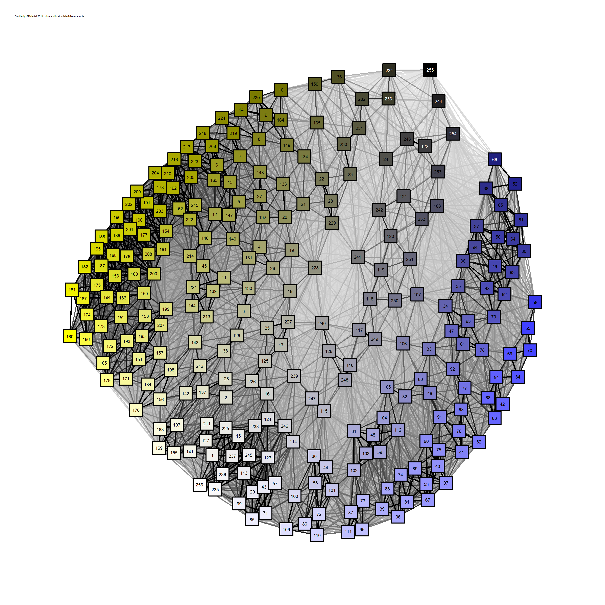

# Introduction and aim

I don’t have color vision deficiency (CVD, commonly called colour
blindness), but I have a persistent interest in choosing CVD-safe
colours that comes from my work as a scientist (because we show data in
graphs) and as a person who teaches R sometimes (because syntax
highlighters show code elements in colour). To support the latter, I
made [a colourblind-friendly theme called Pebble-Safe for
RStudio](https://github.com/DesiQuintans/Pebble-safe) and I am
continuing to [make it easier for people to make their own
themes](https://github.com/DesiQuintans/RStudioThemeTemplate) to suit
their needs.

In making the Pebble-Safe theme, I documented a method of selecting
CVD-safe colours that amounted to *“Shuffle them in a grid and if two
colours look similar beside each other, delete one of them.”* This is
fine and even necessary as a final step, but it definitely shouldn’t be
the *first* step since it’s so effortful.

This time I’m going to use similarity and network analysis methods to
pre-select distant colours.

## Packages used

``` r
# remotes::install_github("DesiQuintans/librarian")
librarian::shelf(tidyverse, gt,
                 DesiQuintans/desiderata,  # Has the data for this analysis
                 qgraph, igraph,
                 spacesXYZ, khroma)  # CVD colour conversion and comparison
```

    ## 
    ##   The 'cran_repo' argument in shelf() was not set, so it will use
    ##   cran_repo = 'https://cran.r-project.org' by default.
    ## 
    ##   To avoid this message, set the 'cran_repo' argument to a CRAN
    ##   mirror URL (see https://cran.r-project.org/mirrors.html) or set
    ##   'quiet = TRUE'.

# Dataset

I’ll be using a dataset from my personal package, which contains
Google’s Material Design 2014 colour palette together with simulated CVD
conversions of those colours that I generated using
`khroma:::anomalize()` (a private function inside that package).

``` r
show_colours(material2014_colblind$normal, n = 14)
```

<!-- -->

``` r
show_colours(material2014_colblind$deutan, n = 14)
```

<!-- -->

``` r
show_colours(material2014_colblind$protan, n = 14)
```

<!-- -->

``` r
show_colours(material2014_colblind$tritan, n = 14)
```

<!-- -->

``` r
show_colours(material2014_colblind$achrom, n = 14)
```

<!-- -->

``` r
mat2014 <- 
    material2014_colblind %>%   # Shorter name
    filter(not.na(name) == TRUE)

glimpse(mat2014)
```

    ## Rows: 256
    ## Columns: 6
    ## $ name   <chr> "red_50", "red_100", "red_200", "red_300", "red_400", "red_500"…
    ## $ normal <chr> "#FFEBEE", "#FFCDD2", "#EF9A9A", "#E57373", "#EF5350", "#F44336…
    ## $ deutan <chr> "#F1F1ED", "#DFDFD0", "#BBBB96", "#A4A46D", "#9E9E44", "#9C9C1E…
    ## $ protan <chr> "#EEEEED", "#D6D6D1", "#ACAC99", "#8F8F72", "#80804E", "#7B7B32…
    ## $ tritan <chr> "#FEEBEB", "#FECDCD", "#EE9A99", "#E47372", "#EF5252", "#F44141…
    ## $ achrom <chr> "#EDEDED", "#D2D2D2", "#9C9C9C", "#767676", "#565656", "#414141…

# Choosing distant colours based on their colour difference

`khroma::compare()` lets me calculate colour distances using the CIELAB
[distance metric recommended in
2000](https://en.wikipedia.org/wiki/Color_difference#CIEDE2000), which
is a wild thing to behold.

``` r
#' Produce a pairwise distance matrix of colours 
#'
#' @param vec (Character) A vector of colours.
#' @param colour_names (Character) Human-readable names of those colours.
#'
#' @return A distance matrix.
#' @export
#'
#' @examples
#' colour_distance(c("#FFFFFF", "#FF0000", "#0000FF"), c("white", "red", "blue"))
colour_distance <- function(vec, colour_names) {
    col_dist <- 
        vec %>% 
        khroma::compare(metric = 2000) %>%   
        as.matrix()
    
    rownames(col_dist) <- colour_names
    colnames(col_dist) <- colour_names
    
    col_dist
}

colour_distance(mat2014$normal[1:4], mat2014$name[1:4])
```

    ##           red_50  red_100   red_200   red_300
    ## red_50   0.00000 10.17361 21.702152 30.098358
    ## red_100 10.17361  0.00000 12.913725 22.343886
    ## red_200 21.70215 12.91373  0.000000  9.718756
    ## red_300 30.09836 22.34389  9.718756  0.000000

I can use these pairwise distances to find which colours are least
similar, and therefore good candidates for high-difference pairings like
syntax highlighting.

``` r
#' From a colour distance matrix, which colour is most distant?
#'
#' @param mat (Dist) A distance matrix.
#' @param colour_names (Character) Human-readable colour names that will be
#'      used to label the rows and columns of `mat`.
#'
#' @return A character vector.
#' @export
#'
#' @examples
#' c_mat <- colour_distance(c("#FFFFFF", "#FF0000", "#0000FF"), c("white", "red", "blue"))
#' furthest_colour(c_mat)
furthest_colour <- function(mat) {
    colour_names <- rownames(mat)
    
    data.frame(name = colour_names,
               furthest = colour_names[max.col(mat, ties.method = "first")])
}

x <- colour_distance(mat2014$normal[12:16], mat2014$name[12:16])

furthest_colour(x)
```

    ##       name furthest
    ## 1 red_a200  pink_50
    ## 2 red_a400  pink_50
    ## 3 red_a700  pink_50
    ## 4  pink_50 red_a700
    ## 5 pink_100 red_a700

## Does it work?

Not really, because it seems to pick the same distant colours
repeatedly.

``` r
dist_normal <- colour_distance(mat2014$normal, mat2014$name)

furthest_normal <- furthest_colour(dist_normal)

sample_n(furthest_normal, 10)
```

    ##               name         furthest
    ## 1       purple_100            black
    ## 2        blue_a700        lime_a200
    ## 3         teal_700        pink_a200
    ## 4       orange_700  deep_purple_900
    ## 5  deep_purple_700        lime_a400
    ## 6          red_300 light_green_a400
    ## 7   light_green_50            black
    ## 8         red_a100        cyan_a400
    ## 9         gray_300            black
    ## 10       green_700      purple_a400

``` r
count_unique(furthest_normal$furthest) %>% arrange(desc(count))
```

    ##              unique count
    ## 1             black    66
    ## 2  light_green_a400    49
    ## 3   deep_purple_900    33
    ## 4       yellow_a200    29
    ## 5         lime_a400    16
    ## 6  deep_purple_a700    12
    ## 7        green_a400     7
    ## 8          pink_900     7
    ## 9       purple_a400     7
    ## 10        lime_a200     6
    ## 11        pink_a400     5
    ## 12        pink_a200     4
    ## 13       indigo_900     3
    ## 14         red_a400     3
    ## 15        cyan_a400     1
    ## 16         pink_600     1
    ## 17         pink_700     1
    ## 18        pink_a100     1
    ## 19        pink_a700     1
    ## 20       purple_900     1
    ## 21      purple_a200     1
    ## 22      purple_a700     1
    ## 23          red_100     1

# Choosing distant colours by graphing

If we want to get the most out of actually *choosing* colours, then
we’re going to have to *look at* them at some point. As I said in the
introduction, my past work involved a lot of shuffling colour swatches
and comparing them side-by-side. Now that I have computed colour
distances, maybe I can make a graph that does most of that work?

``` r
similarity_graph <- function(vec, threshold = 0, file = NULL, 
                             width = 3000, height = 3000, title) {
    mat_dist <- colour_distance(vec, 1:length(vec))
    
    # mat from colour_distance() is a pairwise difference/distance matrix.
    # However, qgraph uses weights as measures of closeness (similarity),
    # not distance. So we need to convert from distance to similarity.
    # https://stats.stackexchange.com/a/158285
    
    colour_similarity <- 1 / (1 + mat_dist)
    
    # I may want to remove a lot of weaker edges to make the major correlations
    # more visible.
    similarity_threshold <- quantile(mat_dist, threshold)
    
    my_graph <- 
        qgraph(colour_similarity, layout = "spring",
               shape = "square", vsize = 2, color = vec,
               # Labelled with the row number of the colour in df.
               label.scale = TRUE, label.scale.equal = TRUE,
               edge.color = "#000000", threshold = similarity_threshold,
               title = title
               )
    
    
    if (is.null(file) == FALSE) {
        png(file, width = width, height = height, unit = "px")
        plot(my_graph)
        dev.off()
    }

    return(list(graph = my_graph, 
                dist = colour_distance, 
                sim = colour_similarity))
}
```

``` r
graph_title <- "Similarity of Material 2014 colours with normal colour vision."
q_normal <- similarity_graph(mat2014$normal, file = "q_normal.png", 
                             title = graph_title)
```

(Right-Click → View these to see them at full resolution. Numbers
correspond to row number in the `mat2014` dataframe.)


``` r
graph_title <- "Similarity of Material 2014 colours with simulated deuteranopia."
q_deutan <- similarity_graph(mat2014$deutan, file = "q_deutan.png", 
                             title = graph_title)
```



``` r
graph_title <- "Similarity of Material 2014 colours with simulated protanopia."
q_protan <- similarity_graph(mat2014$protan, file = "q_protan.png",
                             title = graph_title)
```


``` r
graph_title <- "Similarity of Material 2014 colours with simulated tritanopia."
q_tritan <- similarity_graph(mat2014$tritan, file = "q_tritan.png",
                             title = graph_title)
```


``` r
graph_title <- "Similarity of Material 2014 colours with simulated achromatopsia."
q_achrom <- similarity_graph(mat2014$achrom, file = "q_achrom.png",
                             title = graph_title)
```


Very nice!

# Getting distances from graphs

I wonder if I can choose distant colours using their graph distance?

``` r
graph_distance <- function(qg, cvd, colour_names) {
    dist_table <- 
        distances(as.igraph(qg)) %>% 
        as.data.frame() %>%
        set_names(colour_names) %>% 
        mutate(name = colour_names, .before = everything()) %>% 
        rowwise() %>%
        nest(distances = c(-name)) %>% 
        mutate("{{cvd}}_furthest" := 
                   map_chr(distances, 
                           function(df) {
                               df %>% 
                                   pivot_longer(cols = everything(), 
                                                names_to = "name", values_to = "dist") %>% 
                                   arrange(desc(dist)) %>% 
                                   head(1) %>% 
                                   pull(name)
                           })
               ) %>% 
        select(-distances)
    
    return(dist_table)
}

furthest_normal <- graph_distance(q_normal$graph, normal, mat2014$name)
furthest_deutan <- graph_distance(q_deutan$graph, deutan, mat2014$name)
furthest_protan <- graph_distance(q_protan$graph, protan, mat2014$name)
furthest_tritan <- graph_distance(q_tritan$graph, tritan, mat2014$name)
furthest_achrom <- graph_distance(q_achrom$graph, achrom, mat2014$name)

dist_from_graph <- 
    bind_cols(
        furthest_normal,
        select(furthest_deutan, -name),
        select(furthest_protan, -name),
        select(furthest_tritan, -name),
        select(furthest_achrom, -name)
    ) %>% 
    glimpse()
```

    ## Rows: 256
    ## Columns: 6
    ## $ name            <chr> "red_50", "red_100", "red_200", "red_300", "red_400", …
    ## $ normal_furthest <chr> "brown_300", "brown_300", "brown_300", "gray_500", "br…
    ## $ deutan_furthest <chr> "blue_gray_400", "teal_400", "gray_600", "gray_600", "…
    ## $ protan_furthest <chr> "teal_500", "pink_a200", "gray_600", "gray_600", "gray…
    ## $ tritan_furthest <chr> "deep_purple_300", "deep_purple_300", "deep_purple_300…
    ## $ achrom_furthest <chr> "red_a100", "light_green_a200", "yellow_500", "pink_40…

``` r
sample_n(dist_from_graph, 10)
```

    ## # A tibble: 10 × 6
    ##    name           normal_furthest deutan_furthest protan_furth…¹ trita…² achro…³
    ##    <chr>          <chr>           <chr>           <chr>          <chr>   <chr>  
    ##  1 light_blue_800 gray_500        teal_a700       teal_400       gray_6… lime_4…
    ##  2 green_400      gray_500        gray_600        pink_a200      blue_g… pink_4…
    ##  3 teal_a200      gray_500        teal_500        teal_500       blue_g… brown_…
    ##  4 blue_gray_400  brown_300       brown_300       teal_500       deep_p… green_…
    ##  5 blue_a400      blue_gray_200   teal_a700       pink_200       gray_6… green_…
    ##  6 light_blue_400 blue_gray_400   gray_500        teal_500       blue_g… red_a1…
    ##  7 red_300        gray_500        gray_600        gray_600       deep_p… pink_4…
    ##  8 yellow_700     brown_300       gray_500        teal_400       purple… green_…
    ##  9 red_600        gray_600        gray_600        gray_600       lime_8… teal_6…
    ## 10 red_700        gray_600        gray_600        pink_400       brown_… pink_4…
    ## # … with abbreviated variable names ¹​protan_furthest, ²​tritan_furthest,
    ## #   ³​achrom_furthest

It’s got the same shortcomings in that it keeps picking similar distant
colours.

``` r
mat2014_done <- 
    left_join(mat2014, dist_from_graph, by = "name")

show_furthest_colours <- function(df, cvd) {
    colour_names <-
        df %>%
        pull(paste0(cvd, "_furthest")) %>%
        unique()
    
    supposedly_distinct <-
        df %>%
        filter(name %in% colour_names) %>%
        pull(paste0(cvd))
    
    show_colours(supposedly_distinct)
}

show_furthest_colours(mat2014_done, "normal")
```

<!-- -->

``` r
show_furthest_colours(mat2014_done, "deutan")
```

<!-- -->

``` r
show_furthest_colours(mat2014_done, "protan")
```

<!-- -->

``` r
show_furthest_colours(mat2014_done, "tritan")
```

<!-- -->

``` r
show_furthest_colours(mat2014_done, "achrom")
```

<!-- -->

I’m not really sure where to go from there programmatically, but I think
the graphs are incredibly handy. They let me see all of the colours and
how they relate to each other, and the graphs *do* put very similar
colours close together so that I don’t have to think too hard about
distinctiveness.
